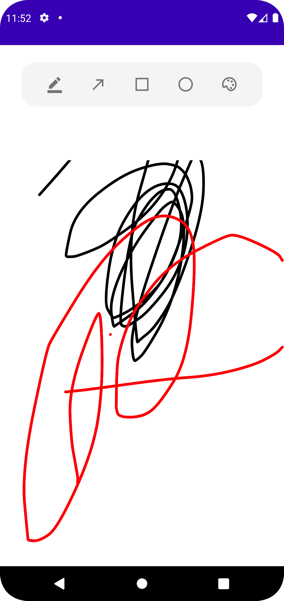
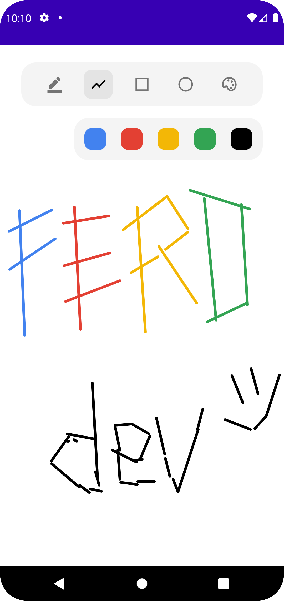
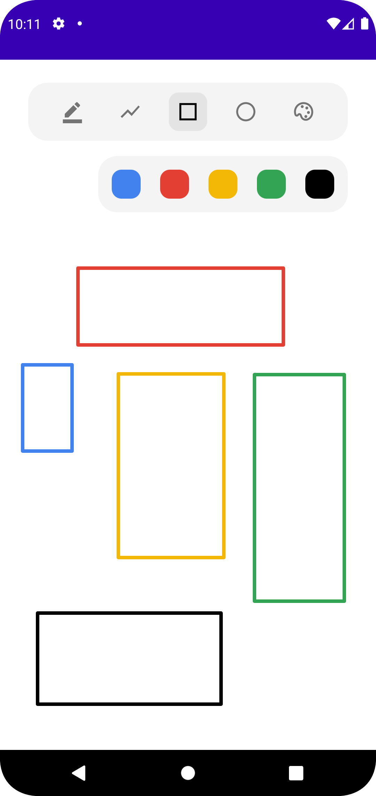
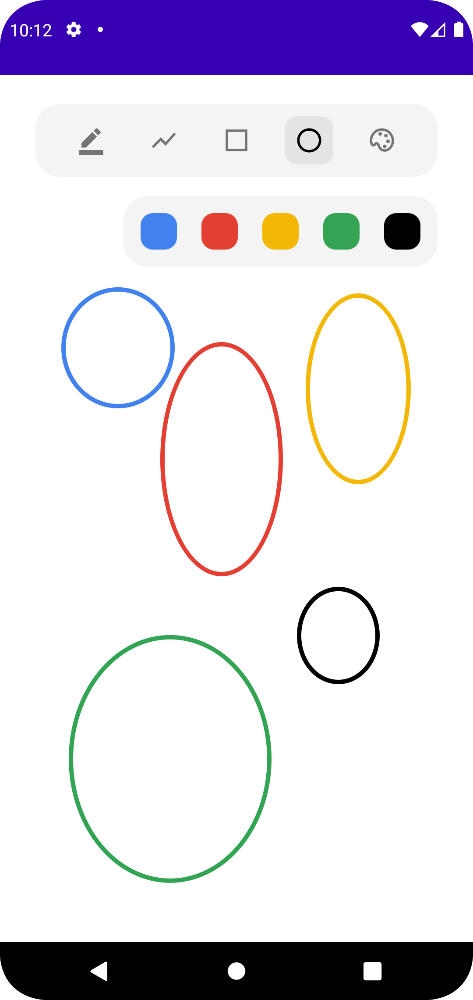

## Simple Paint Android Apps with Kotlin

## Screen Shoot Apps

|Free Hand Drawing |   Draw a Line              |   Draw a Rectangle    | Draw a Circle |
|:------------------:|:----------------------------:|:---------------------:|:-----------------:|
| |  |  |  |

## Colaborator
Very open to anyone, I'll write your name under this, please contribute by sending an email to me

- Mail to firaferonika27@gmail.com
- Subject : Github _ [Github-Username-Account] _ [Language] _ [Repository-Name]
- Example : Github_feronikanm_kotlin_simple-paint

Name of Contributor 
- Feronika Nur Maghfiro
- Waiting List
- Waiting List

Waiting for your contribute

## Insipiration
- Create a Simple Paint Application in Android using Kotlin ( [GeeksforGeeks](https://www.youtube.com/channel/UC0RhatS1pyxInC00YKjjBqQ) - [Video Tutorial](https://www.youtube.com/watch?v=8mjv_iDSLcw) )
- How to Create a Paint Application in Android in Java ( [Raghav Sharma](https://github.com/raghavtilak) - [Tutorial](https://www.geeksforgeeks.org/how-to-create-a-paint-application-in-android/) - [Project](https://github.com/raghavtilak/Paint) )

## Attention !!!
- Please enjoy and don't forget fork and give a star
- Don't Forget Follow My Github Account

